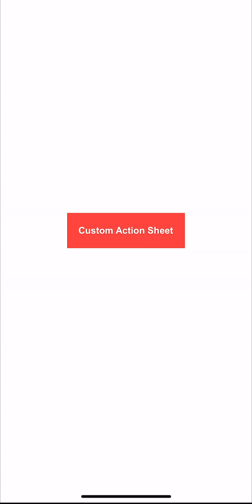

# CustomActionSheet

A customizable action sheet for iOS, written in Swift. Easily display action buttons with icons, titles, and a modern UI. Supports system images, asset images, or any custom `UIImage`.

## ✨ Features

- Custom title, icons, and colors
- Support for SF Symbols, asset images, or custom images
- Tap handling with closures
- Smooth animation
- Shadow support
- Fully customizable via `ActionSheetStyle`


CustomActionSheet/
│
├── Package.swift
├── README.md
├── LICENSE
├──Images /
│    └── customAction.gif/
│
└── Sources/
    └── CustomActionSheet/
       └── CustomActionSheet.swift

        
## 📦 Installation

### Swift Package Manager (SPM)

1. Open your Xcode project.
2. Go to **File > Add Packages**.
3. Enter the URL: https://github.com/mrushdi24/CustomActionSheet-SPM.git


4. Choose the latest version and add the package to your project.

## 🛠 Usage

### 1. Import the module

```swift
import CustomActionSheet

```

### 2. Create actions

```swift
let actions = [
    ActionSheet(icon: .system(name: "trash"), title: "Delete"),
    ActionSheet(icon: .asset(name: "customIcon"), title: "Archive"),
    ActionSheet(icon: .image(image: UIImage(named: "avatar")!), title: "Profile")
]
```
### 3. Define style (optional)
   
```swift
let style = ActionSheetStyle(
    titleFont: .systemFont(ofSize: 17, weight: .semibold),
    titleTextColor: .black,
    itemFont: .systemFont(ofSize: 17, weight: .medium),
    itemTextColor: .red,
    iconTintColor: .white,
    iconBackgroundColor: .black,
    cancelFont: .systemFont(ofSize: 18, weight: .bold),
    cancelTextColor: .systemBlue,
)
```

### 4. Present the sheet

```swift
let sheet = CustomActionSheet(
    actions: actions,
    title: "Choose Option",
    style: style
) { selectedIndex in
    switch index {
    case 0: print("Selected action at index: 0")
    case 1: print("Selected action at index: 1")
    default: break
    
}

sheet.present(in: self.view)
```


📸 Preview



✅ Requirements

iOS 13.0+

Swift 5.0+

📄 License

This project is licensed under the MIT License.
